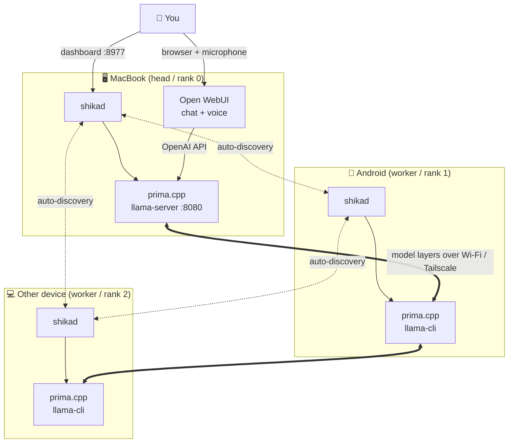

<div align="center">

# shikA

**Turn every device you own into one shared, private AI.**

Install one small app on each device. On the same Wi-Fi (or over [Tailscale](https://tailscale.com)) they find each other automatically, pool their power with [prima.cpp](https://github.com/OpenCPIL/prima.cpp) to run a single large model, and give you a chat + voice assistant in your browser — plus a dashboard to see and manage every connected device.

</div>

---

> **Status: early scaffold (v0.1).** The orchestrator (device discovery, mesh membership, cluster planning, supervisor, control API, dashboard) builds and runs today. Automatic prima.cpp launch, voice, and Tailscale wiring are on the [roadmap](ROADMAP.md). This repo is meant to be built *in the open* — see [issues](../../issues) and [CONTRIBUTING](CONTRIBUTING.md).

## The idea

Tools like [Ollama](https://ollama.com) run a model on **one** machine. [prima.cpp](https://github.com/OpenCPIL/prima.cpp) can split a model across **several** machines, but wiring it up by hand (IP addresses, ranks, ring order, ports, one launch command per device) is fiddly and static.

**shikA is the missing layer on top.** A single background service — `shikad` — runs on each device and does the boring parts for you:

- **Finds devices automatically.** Zero-config discovery on the LAN, plus seed addresses for [Tailscale](https://tailscale.com)/remote peers.
- **Plans the cluster.** Picks the strongest device as the head, assigns ranks, builds the ring — the *same* result on every node, no central server.
- **Drives prima.cpp.** Generates and supervises the exact `llama-server` / `llama-cli` command each device should run.
- **Gives you one endpoint.** The head exposes an OpenAI-compatible API, which you point [Open WebUI](https://openwebui.com) at for chat **and voice** (Whisper STT + TTS built in).
- **Shows you everything.** A device-management dashboard: who's connected, their RAM/cores/role, cluster status, start/stop.

You bring the model — including an **uncensored** one if you want (it's just a GGUF file path in the config).

## Architecture



Two planes, on purpose:

- **Control plane — shikA (this repo, Go).** Discovery, membership, planning, supervision, dashboard. One dependency-free binary per device.
- **Data plane — prima.cpp (C++).** The actual distributed model inference. shikA launches and configures it; it does not reimplement it.

See [ARCHITECTURE.md](ARCHITECTURE.md) for the full breakdown.

## Quick start (developer preview)

Requires [Go 1.22+](https://go.dev/dl/). prima.cpp itself is optional for now — without it the orchestrator runs in **dry-run** and shows you the exact command it *would* launch.

```bash
git clone https://github.com/braymix/shika.git
cd shikA
make run            # or: go run ./cmd/shikad
```

Then open the dashboard at **http://localhost:8977**. Start `shikad` on a second device on the same Wi-Fi and watch it appear automatically.

To actually serve a model, install prima.cpp on each device (see the [prima.cpp setup guide](https://github.com/OpenCPIL/prima.cpp)), put the **same** GGUF under `~/prima.cpp/download/`, then press **Start cluster** on the dashboard (or run with `-autostart`).

Point [Open WebUI](https://docs.openwebui.com) at the endpoint shown on the dashboard (`http://<head-ip>:8080/v1`) to get chat + voice.

## Configuration

`shikad` runs with sane defaults and no config file. To customise, copy [`configs/shika.example.json`](configs/shika.example.json) and pass it with `-config`:

```bash
shikad -config my-node.json -name "living-room-pc"
```

Key fields: `model` (the GGUF filename), `seeds` (Tailscale/remote peer control addresses), `llm_port`, and the prima.cpp `data_port` / `signal_port`. Full list in the example file.

## Roadmap (short version)

| Phase | What | State |
|------|------|-------|
| 0 | Orchestrator skeleton: discovery, plan, dashboard, API | ✅ this repo |
| 1 | Auto-launch & supervise real prima.cpp across 2+ devices | 🔜 |
| 2 | Open WebUI auto-config + one-click voice assistant | 🔜 |
| 3 | Tailscale integration (remote devices, no port juggling) | 🔜 |
| 4 | Packaged installers (macOS `.app`, Android/Termux, Windows) | 🔜 |
| 5 | Model manager (pick/download models, incl. uncensored) from the dashboard | 🔜 |

Full detail in [ROADMAP.md](ROADMAP.md).

## A note on models & responsibility

shikA is model-agnostic: it runs whatever GGUF you point it at, censored or not, on **your own hardware, on your own network**. Choosing and running a model — and using its output lawfully and responsibly — is up to you. The project ships no model and endorses no particular one.

## Built on

[prima.cpp](https://github.com/OpenCPIL/prima.cpp) · [llama.cpp](https://github.com/ggml-org/llama.cpp) · [Open WebUI](https://openwebui.com) · [Tailscale](https://tailscale.com)

## License

[MIT](LICENSE).
